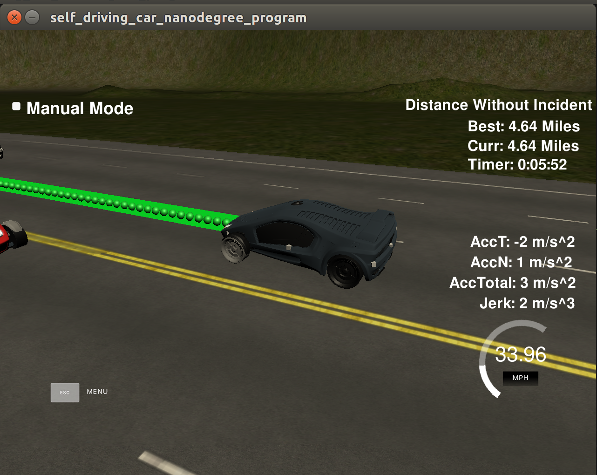
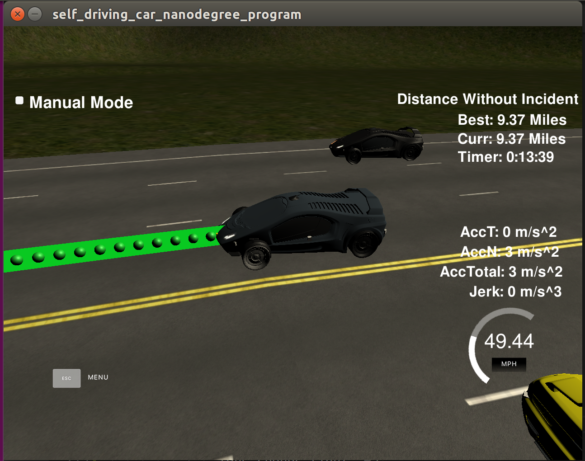

# CarND-Path-Planning-Project
Self-Driving Car Engineer Nanodegree Program
   

### Goals
The goal of the project is to safely navigate around a virtual highway with other traffic that is driving +-10 MPH of the 50 MPH speed limit using provided the car's localization and sensor fusion data and a sparse map list of waypoints around the highway. The car should try to go as close as possible to the 50 MPH speed limit, which means passing slower traffic when possible, while other cars will try to change lanes. The car should avoid hitting other cars at all cost as well as driving inside of the marked road lanes at all times, unless going from one lane to another.
The car should be able to make one complete loop around the 6946m highway. Since the car is trying to go 50 MPH, it should take a little over 5 minutes to complete 1 loop. Also the car should not experience total acceleration over 10 m/s^2 and jerk that is greater than 10 m/s^3.

#### The map of the highway is in data/highway_map.txt
Each waypoint in the list contains  [x,y,s,dx,dy] values. x and y are the waypoint's map coordinate position, the s value is the distance along the road to get to that waypoint in meters, the dx and dy values define the unit normal vector pointing outward of the highway loop.

The highway's waypoints loop around so the frenet s value, distance along the road, goes from 0 to 6945.554.

### Simulator.
You can download the Term3 Simulator which contains the Path Planning Project from the [releases tab (https://github.com/udacity/self-driving-car-sim/releases/tag/T3_v1.2).  

To run the simulator on Mac/Linux, first make the binary file executable with the following command:
```shell
sudo chmod u+x {simulator_file_name}
```
## Basic Build Instructions

1. Clone this repo.
2. Make a build directory: `mkdir build && cd build`
3. Compile: `cmake .. && make`
4. Run it: `./path_planning`

## Dependencies

* cmake >= 3.5
  * All OSes: [click here for installation instructions](https://cmake.org/install/)
* make >= 4.1
  * Linux: make is installed by default on most Linux distros
  * Mac: [install Xcode command line tools to get make](https://developer.apple.com/xcode/features/)
  * Windows: [Click here for installation instructions](http://gnuwin32.sourceforge.net/packages/make.htm)
* gcc/g++ >= 5.4
  * Linux: gcc / g++ is installed by default on most Linux distros
  * Mac: same deal as make - [install Xcode command line tools]((https://developer.apple.com/xcode/features/)
  * Windows: recommend using [MinGW](http://www.mingw.org/)
* [uWebSockets](https://github.com/uWebSockets/uWebSockets)
  * Run either `install-mac.sh` or `install-ubuntu.sh`.
  * If you install from source, checkout to commit `e94b6e1`, i.e.
    ```
    git clone https://github.com/uWebSockets/uWebSockets 
    cd uWebSockets
    git checkout e94b6e1
    ```
## Rubic Points
### Compilation 
#### 1. The code compiles correctly.
No changes were made in the cmake configuration and the code compiles without an error. A new file was added src/spline.h. It is the Cubic Spline interpolation implementation: a single .h file you can use splines instead of polynomials. It was a great suggestion from the classroom QA video.

### Valid Trajectories 
#### 1. The car is able to drive at least 4.32 miles without incident.
The car was able to drive more 4.32 miles comfortably at a average speed of 47.5 mph.


Then I ran the car for over 9 miles without any incedent.


#### 2. The car drives according to the speed limit.
No speed limit red message was seen.
#### 3. Max Acceleration and Jerk are not Exceeded. 
Max jerk warning was not seen.
#### 4. Car does not have collisions.
No collisions occured.
#### 5. The car stays in its lane, except for the time between changing lanes.
The car stays in its lane most of the time but when it changes lane because of traffic or to return to the center lane.
#### 6. The car is able to change lanes.
The car change lanes when the there is a slow car in front of it, and it is safe to change lanes (no other cars around) or when it is safe to return the center lane.

### Reflection

Based on the provided code from the seed project, the path planning algorithms could be separated into different functions to show the overall process, but I prefer to have everything in a single place to avoid jumping to different parts of the file or other files. In a more complicated environment and different requirements, more structure could be used. For now, comments are provided to improve the code readability.

The code consist of three parts:

#### Sensor Fusion
This part of the code deal with the telemetry and sensor fusion data. It intents to reason about the environment. In the case, we want to know three aspects of it:

- Is there a car in front of us blocking the traffic ?
- Is there a car to the right of us making a lane change not safe ?
- Is there a car to the left of us making a lane change not safe ?

These questions are answered by calculating the lane each other car is and the position it will be at the end of the last plan trajectory. A car is considered "dangerous" when its distance to our car is less than 30 meters in front of us. A window of 10m in length is considered as safe to make a lane change if it exists.

#### Behavior Planning
This part decides what to do:
  - If we have a car in front of us, do we change lanes ?
  - Do we speed up or slow down ?

Based on the sensor fusion data of the situation we are in, this code increases the speed, decrease speed, or make a lane change when it is safe. Instead of increasing the speed at this part of the code, a `brake` and `accel` are created to be added to the `ref_vel` which is later used for speed changes when generating the trajectory in the last part of the code. This approach makes the car more responsive acting faster to changing situations like a car in front of it trying to apply breaks to cause a collision.

#### Trajectory Generation
This code does the calculation of the trajectory based on the speed and lane output from the behavior, car coordinates and past path points.

First, the last two points of the previous trajectory (or the car position if there are no previous trajectory) are used in conjunction three points at a far distance to initialize the spline calculation. To make the work less complicated to the spline calculation based on those points, the coordinates are transformed (shift and rotation) to local car coordinates.

In order to ensure more continuity on the trajectory (in addition to adding the last two point of the pass trajectory to the spline adjustment), the pass trajectory points are copied to the new trajectory. The rest of the points are calculated by evaluating the spline and transforming the output coordinates to not local coordinates. The speed change is decided on the behavior part of the code, but it is used in that part to increase/decrease speed on every trajectory points instead of doing it for the complete trajectory by varying the spacing between each of the points generated. This approach is also highlighted in the comments of the code.
